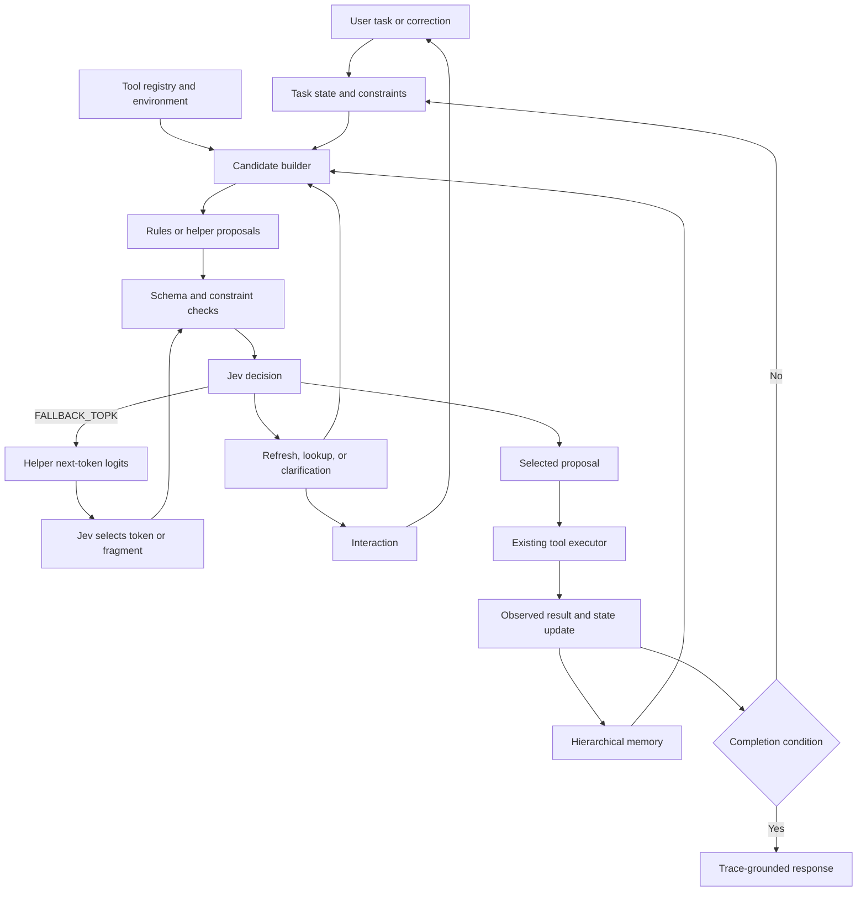

# A Jev-Native Agent System: Tool Use, Hierarchical Memory, and Natural Interaction

| Item | Value |
| --- | --- |
| Version | v0.4-design |
| Draft date | 2026-09-23 |
| Document type | Public technical design draft |
| Status | In progress; design, prototype implementation, and evaluation are being developed together |
| Author | Anonymous |

## Abstract

Jev provides a structured decision interface over explicit options. This is useful for choosing among actions, but agent systems built around free-form generation also need to construct tool arguments, maintain state, and communicate with users. This document proposes a Jev-native agent loop that fills that gap with explicit candidate management.

The system reuses tool schemas and executors, asks a small autoregressive model or a diffusion model to propose complete arguments, fields, or fragments, and lets Jev select among them. When the coarse proposals are unsuitable and the task information is sufficient, Jev can select an explicit `FALLBACK_TOPK` action. The helper model then computes logits for the current parameter prefix. The highest-probability `k` tokens form a dynamic token table; Jev chooses the next token from that table, appends it to the prefix, and requests the next logits. In control flow this resembles next-token sampling in a generative language model, while Jev retains the decision over every presented option. The design also includes decision-impact hierarchical memory (I1), dependency-aware local replanning (I3), an independent candidate-coverage problem (I2), natural interaction, candidate refresh, and cost accounting.

The project is in progress. The protocol and prototype are being developed alongside baseline evaluation; performance and reliability results are not complete. This document makes no novelty guarantee. The proposed logits interface and rejection-triggered fallback still require controlled comparison.

## 1. Motivation and scope

There are three related problems.

First, a model whose primary interface is a distribution over explicit options needs an agent loop that represents actions, dependencies, stop conditions, and execution feedback directly. A long conversational transcript is not always the best working memory for this interface.

Second, existing tools should remain usable, especially when a field is open ended. Tool names and enum fields can become options directly, while search expressions, paths, new names, SQL conditions, and business descriptions need a proposal mechanism.

Third, users should be able to describe a goal in ordinary language, correct it during execution, and answer only the questions that matter. The system should construct decision questions and recover from missing information without requiring users to hand-write every option.

The system aims to provide an end-to-end loop from task input, tool execution, observation, memory update, and user-facing response; reuse existing schemas, registries, MCP interfaces, and executors; support complete, field-level, fragment, and token-level proposals; preserve useful alternatives in cold storage; replan only affected dependencies; and evaluate total cost per successful task.

This version is a proposal. I1 and I3 are in the main design. I2 is documented separately. Adaptive granularity (I4), unified budget scheduling (I5), and execution-feedback training for candidate generation (I6) remain optional directions.

## 2. Jev assumptions

The design uses Jev `Choice` as the main decision primitive and may use `Score` or `Noul` for auxiliary judgments. The option probabilities are conditional on the question, state, and candidate set; they are not a complete language-model next-token distribution, and confidence is not an independent guarantee of task success. Implementations must record model versions and respect the service's option, context, rate, and budget limits.

The proposed data structures below are system structures, not TypeSafe API formats. A candidate record can include a candidate ID, tool and schema versions, arguments, source, task revision, evidence references, dependency references, validation status, execution status, storage tier, and validity. Decision records should additionally retain the candidate-set ID, option order, question, probabilities, and model version.

## 3. Architecture



The candidate builder collects values from schemas, environment observations, user text, memory, deterministic rules, and helper models. Jev chooses a proposal or a recovery control. The executor is responsible for real side effects; an unexecuted proposal is never recorded as a completed fact.

## 4. Reusing tools and handling open arguments

The adapter should reuse tool schemas, registries, MCP interfaces, and framework executors, while handling call IDs, asynchronous results, cancellation, authentication, errors, and session state. Supported scope must be listed per adapter.

Parameter sources can be divided into closed enums, environment entities, values copied from user text, deterministic values, open text or new values, and structures that depend on several fields. The basic flow is:

1. Read the schema, goal, fixed fields, and available entities.
2. Fill values from source text, observations, and deterministic rules.
3. Ask the helper to propose remaining fields or complete calls.
4. Check types, ranges, entity existence, and cross-field constraints.
5. Give valid candidates and their evidence to Jev.
6. Offer `FALLBACK_TOPK`, `REPROPOSE`, `LOOKUP`, `CLARIFY`, and `STOP_UNRESOLVED` when appropriate.
7. Recheck task and schema versions immediately before execution.
8. Execute and use the real result to continue or repair the task.

Pydantic AI already documents Jev integration and an LLM fallback for unsupported arguments. This proposal studies finer-grained construction, shared dependencies, and conditional fallback while retaining Jev's decision role.

## 5. Helper model and training

The helper may run locally or as a service. It can propose complete calls, fields, fragments, clarification questions, or user-facing wording. On a backend that exposes logits, it can also return next-token or short-fragment candidates for the fallback path. The decision interface and proposal source stay separate so the helper can be replaced.

Supervised fine-tuning is an optional direction. Training records may include the goal, schema, observations, fixed fields, candidate set, validation, Jev choice, execution result, and task result. “Chosen by Jev” is not a success label. Training must distinguish selection, execution, and task completion to avoid amplifying selection bias.

## 6. Speculative proposals and Top-k fallback

### 6.1 Coarse proposals first

The normal path starts with complete calls, fields, or short fragments proposed by a helper or diffusion model. The control options are part of the same Jev decision. If the proposals are unsuitable, the task information is sufficient, a logits-capable helper is available, and budget remains, Jev may choose `FALLBACK_TOPK`.

The helper computes next-token logits conditioned on the prefix that Jev actually selected. The system filters the Top-k tokens through grammar and schema constraints, presents the viable extensions as Jev options, appends the selected token, and repeats. “Jev chooses” means that Jev retains the decision authority; the logits still come from the helper.

The fallback starts at the missing field or the most recent valid checkpoint. Other verified fields remain fixed while their dependencies are unchanged. The helper must recompute logits after every chosen prefix, including cache updates. A helper EOS is only a completion request; the finished parameter still requires full validation.

### 6.2 Algorithm sketch

```text
drafts = propose_complete_fields_or_fragments(state, schema)
drafts = validate_drafts(drafts)
controls = [REPROPOSE, LOOKUP, CLARIFY, STOP_UNRESOLVED]
if helper supports logits and fallback budget remains:
    controls += [FALLBACK_TOPK]
decision = jev.choose(state, drafts + controls)

if decision selects a draft:
    return revalidated_parameter_or_next_field(decision)
if decision == FALLBACK_TOPK:
    return construct_with_topk(last_valid_prefix)
return recovery_state(decision)
```

```text
prefix = parameter_prefix
while budget remains:
    logits = helper.next_logits(context, prefix)
    tokens = filter_top_k(logits, grammar_and_schema_constraints)
    options = validate_partial_extensions(prefix, tokens)
    options += [EXPAND_K, REPROPOSE, BACKTRACK,
                LOOKUP, CLARIFY, STOP_UNRESOLVED]
    if prefix satisfies complete constraints:
        options += [FINISH]
    decision = jev.choose(context, options)
    if decision == FINISH:
        return validate_complete_parameter(prefix)
    if decision is a recovery action:
        return recovery_state(decision)
    prefix = exact_extension_selected_by(decision)
return explicit_failure_or_clarification()
```

The implementation must map a decision to an exact token ID or payload. Explanatory text must not change the argument. Subword and byte tokens may be displayed as a readable joined prefix while the executor receives the exact payload. Token, request, wall-clock, expansion, and backtracking budgets bound the path. If all legal extensions are exhausted, the state changes, or logits are unavailable, the system can re-propose, look up facts, ask the user, backtrack, or stop.

### 6.3 Granularity and speculative decoding

Complete calls use fewer decision rounds but may be harder to propose. Complete fields preserve structure. Fragments provide local control. Tokens provide the finest control at the cost of serial latency and truncation risk. I4 may learn this choice from cost and history; this version uses the explicit coarse-first path.

The design is inspired by proposal-and-verification relationships in speculative decoding, but it does not preserve a target language-model distribution. Jev probabilities are probabilities over the supplied options. This is not a claim of lossless speculative decoding.

### 6.4 Known related work and bounded originality claim

ChatJev and jevchat already show repeated Jev choices over a fixed word, character, or token list. Their candidate lists are supplied by the program; they do not implement the external helper-logits interface or the tool-argument rejection fallback proposed here. ChatJev's displayed probability ranking is a view of Jev's returned probabilities, not helper-model logits.

FUDGE uses a generator's next-token candidates and a discriminator to adjust generation, while Reward-Guided Speculative Decoding rejects a draft and asks a target generative model to produce a new step. Pydantic AI documents whole-step LLM fallback for unsupported Jev tool arguments. These are close components, but they do not, in the sources checked here, combine coarse tool-argument rejection, external helper logits Top-k, and continued Jev control in one path.

The bounded search conducted on 2026-09-23 did not locate an identical public Jev implementation. This is a search result, not proof of global priority. The testable research claim is narrower: for open tool arguments, compare a Jev-triggered helper-logits Top-k fallback that preserves Jev's selection authority against whole-step LLM fallback, always-complete proposals, always-token-level selection, and unconditional re-proposal.

### 6.5 Failure modes

- The correct token is outside Top-k: expand k, re-propose, retrieve the source, backtrack, or ask for clarification.
- Every option is poor but one receives high probability: use independent validation and evidence checks.
- A locally good token creates an invalid complete call: validate at field and full-call boundaries.
- Candidate wording biases Jev: keep exact payloads, vary order in evaluation, and separate descriptions from execution data.
- Each token requires a network round trip: report the serial critical path against field and complete-call baselines.
- Missing facts cannot be invented by continuation: look up the environment or clarify first.

## 7. Diffusion proposals

A diffusion language model may generate a batch of complete parameters or fragments from the goal, schema, fixed fields, and state. It may offer different diversity or batching behavior, but architecture alone does not guarantee speed, validity, or lower cost. Refresh proposals when the tool, business rules, user intent, or environment changes. Treat the diffusion generator as another implementation of the proposal interface, including provenance and validation.

## 8. Hierarchical memory

The memory design starts with hot working state, recent trajectory, durable facts, cold unselected branches, and archived evidence. The selected path stays hot; unselected candidates and their reasons can move to cold storage. A cold item can return when a dependency or user constraint makes it relevant again.

I1 adds decision impact to ordinary similarity retrieval. Each item records the entities, fields, constraints, candidate branches, evidence, and task revision it touches. Under a fixed context budget, retrieve items that can change candidate feasibility, parameter provenance, or the next Jev decision. Evaluate this against recency, semantic similarity, and fixed hot/cold policies at equal token budgets. A changed action after removing a memory item is not automatically a beneficial change; execution outcomes still decide.

## 9. Dependency-aware replanning (I3)

Candidates, parameters, observations, and memories carry explicit dependency references. A changed goal, schema, resource, user constraint, or environment version produces an invalidation set. Propagate invalidation through direct and indirect dependencies, pause affected pending calls and prefixes, keep immutable execution history, recover still-relevant cold branches, and reconstruct only missing or invalid fields. If a dependency cannot be shown to remain valid, rebuild a wider region. This mechanism does not roll back external side effects.

## 10. Natural interaction

Users provide free-form goals and corrections. The system turns them into candidate questions and only asks for missing facts or unresolved preferences. If facts are present but the proposal construction is poor, it can re-propose or enter Top-k fallback. After an answer, increment the task revision, invalidate affected prefixes, refresh I1 memory, and replan through I3. User-facing explanations should be grounded in observable actions, tool results, and unresolved items; generated wording must not be presented as Jev's hidden reasoning.

## 11. Worked example

For a request to diagnose a staging inference service, the system extracts an OOM symptom and reads the service inventory. Jev chooses a service candidate, the existing logs and metrics tools run, and a helper proposes open query strings. If complete queries do not express the required combination of context length and allocator state, Jev may choose `FALLBACK_TOPK`; the helper supplies logits from the query prefix, Jev selects extensions, and the full call is checked again. If the service name or relevant field is unknown, the system looks it up or asks the user rather than hallucinating it through continuation. A later user correction changes only dependent candidates and memories.

## 12. Cost and evaluation

Track total cost as `C_task = C_Jev + C_proposal + C_memory + C_tools + C_recovery`, counting rejected proposals and every fallback round. For sequential prefix construction, report `T_parameter = sum(T_proposal_i + T_Jev_i + T_validation_i)` and the serial network path. Compare whole-step LLM fallback, helper-only execution, complete-proposal reranking, no Top-k, always Top-k, explicit fallback, fixed granularity, adaptive granularity, autoregressive and diffusion proposal generators, and the memory and replanning baselines.

Tasks should include closed and open fields, cross-field dependencies, unseen tools, schema changes, user corrections, and long-running recovery. Record task success, candidate coverage, valid and semantically correct parameters, first-attempt success, total cost, P50/P95 latency, serial rounds, context tokens, stale-state errors, clarification turns, fallback trigger rate, invalid trigger rate, fallback repair rate, and budget exhaustion. Use deterministic checks, environment state, or independent human review for task outcomes rather than Jev's own repeated score.

## 13. Related work and contribution boundary

- [TypeSafe function calling](https://docs.typesafe.ai/cookbooks/function_calling) and [speculative fan-out](https://docs.typesafe.ai/patterns/fan-out) provide existing typed-choice and pre-question patterns.
- [Pydantic AI Jev integration](https://pydantic.dev/docs/ai/models/typesafe/) provides Jev tools and whole-step LLM fallback.
- [jev-browser](https://github.com/jkudish/jev-browser) combines Jev browser decisions with helper text generation; [jev-memory](https://github.com/NicolasMontone/jev-memory) provides Jev memory operations.
- [ChatJev](https://github.com/erik-dunteman/ChatJev) and [jevchat](https://github.com/kyle-pena-nlp/jevchat) provide iterative Jev selection over fixed word, character, or token alphabets.
- [FUDGE](https://aclanthology.org/2021.naacl-main.276/) provides generic generator Top-200 candidate filtering with a discriminator; [Reward-Guided Speculative Decoding](https://arxiv.org/abs/2501.19324) provides draft rejection followed by target-model generation.
- [FANTASE](https://aclanthology.org/2024.findings-emnlp.359/) and [Leviathan et al.](https://proceedings.mlr.press/v202/leviathan23a.html) cover constrained API generation and distribution-preserving speculative decoding, respectively.

The document therefore does not claim the first Jev agent, the first Jev text loop, the first helper-assisted Jev system, or the first use of Top-k. It records a narrower combination for implementation and comparison: external helper logits Top-k proposed from the actually selected prefix, chosen by Jev, activated after a coarse tool-argument proposal is rejected, inside a tool-executing agent with I1 and I3 state management.

## 14. Open questions and implementation order

Implement the basic tool and state loop first, then I1/I3 memory and replanning, then the coarse-proposal and Jev-triggered fallback path, then optional diffusion, adaptive scheduling, and feedback training. Open questions include whether Jev can reliably judge token fragments, whether the serial cost is worth the repair rate, whether diffusion improves diverse valid proposals, whether memory maintenance saves tokens, and which tasks remain better served by a conventional generative agent.

## Appendix: status and provenance

This repository is an independent anonymous design and is not affiliated with TypeSafe. The draft date is not a publication date. The source check and originality wording above were updated on 2026-09-23. Implementation, benchmarks, and measured claims remain future work.
