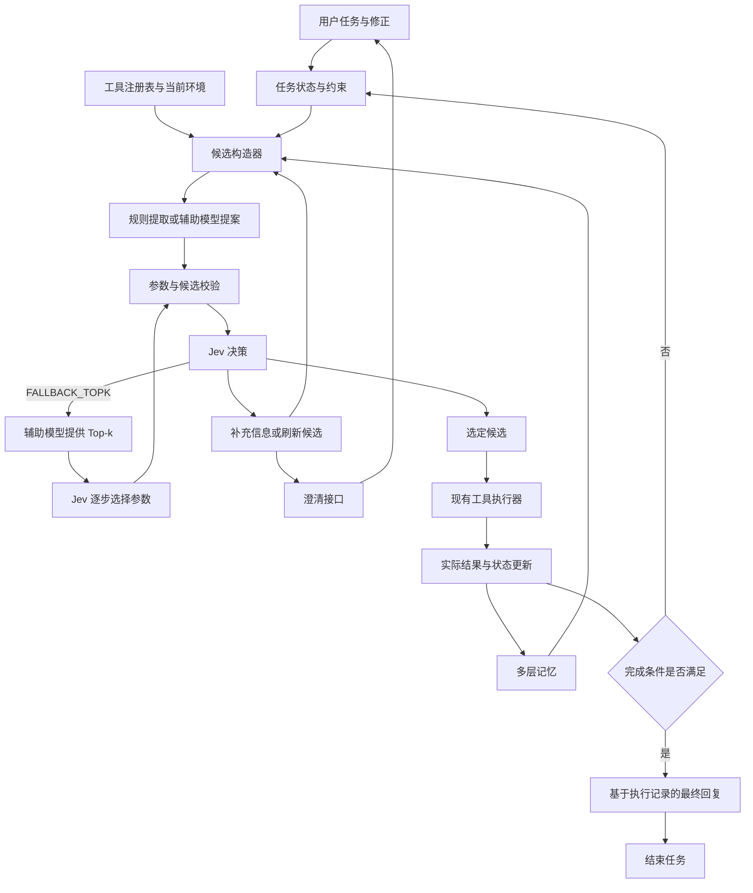

# Jev 原生 Agent 系统：工具调用、分层记忆与自然交互

**A Jev-Native Agent System: Tool Use, Hierarchical Memory, and Natural Interaction for Decision Models**

| 项目 | 信息 |
| --- | --- |
| 文档版本 | v0.6-prototype |
| 初稿日期 | 2026-09-23 |
| 文档类型 | 公开技术设计草案 |
| 当前状态 | 核心 agent、TypeSafeJeV 适配器与逐 token helper 接口已实现；真实 Jev 长回答评测尚未完成 |
| 作者 | 匿名作者 |

## 摘要

Jev 提供对预设选项的结构化决策接口。这类模型适合在已有候选中选择，但以自由文本生成作为主要接口的 agent 系统往往要求模型构造工具参数、维护上下文并与用户交流。两种接口之间存在需要工程与研究工作填补的差距。

本文提出围绕 Jev 构建完整 agent 系统的设计，并记录已实现的核心 agent、TypeSafeJeV 适配器与逐 token helper 接口：系统可从现有工具定义、环境与记忆自动构造候选；使用可替换的外部生成模型提供开放参数与文本生成所需的下一 token logits；设计上由 Jev 选择，或显式进入 Top-k 回退。回退时，外部辅助生成模型根据当前参数前缀输出 logits，取概率最高的 k 个 token 形成动态 token 表，再由选择器逐步选择并更新前缀。当前保存的四题长回答与速度实验使用 `local_top1_proxy`，即直接选取 helper 的 top-1 token，并非真实 Jev 逐 token 选择；真实 Jev 仅完成过一次工具候选 smoke test，尚未验证长回答能力。因此，句子级自然语言对话仍是待验证目标，不是已证实结果。系统其余设计包括按决策影响组织多层记忆、沿依赖关系局部重规划，以及用辅助语言接口支持自然任务输入、澄清和修改；工具执行后更新真实状态，再进入下一轮决策。

本方案关注现有工具生态的复用、开放参数的构造、候选的动态刷新、决策路径与记忆的协同，以及整个任务的成本。当前代码包含可运行的逐 token helper 路径；保存的连贯长回答由 `local_top1_proxy`（每步直接选择 helper 的 top-1）生成，不能据此证明真实 Jev 能连续生成完整回答。Qwen‑0.8B 是早期实验中的一个低成本实现选择，不是系统定义的一部分。项目目前处于进行中阶段，正在整理代码、建立基线并补充真实 Jev 评估；所有收益假设仍需实验检验。

### 1.4 与固定词表生成的区别

固定词表方案把字符、词或短语预先写入选项，再让 Jev 重复选择。这种方式可以验证连续选择流程，但可能受到词表覆盖、未登录词、分词边界、组合效率和上下文连贯性的限制；词表没有覆盖的表达只能近似拼接，输出质量依赖词表设计。

设计上，外部生成模型根据已经选中的文本前缀动态计算 logits，并把概率最高的 token 组成当前轮 token 表；选择器选出 token 后，系统把它加入前缀，再计算下一轮 token 表。候选因此来自语言模型的上下文分布，目标是在保留 Jev 逐步决策的同时支持自然语言交流。当前实现了逐 token helper 路径，但已保存的长回答由 `local_top1_proxy` 生成；真实 Jev 长回答的流畅度、成本和错误率仍需实测。

### 实现与证据边界

当前代码实现了核心 agent、TypeSafeJeV 适配器和逐 token helper 路径。已保存的四题完整回答及速度数据来自 `local_top1_proxy`（每步直接选 helper 的 top-1），不能作为真实 Jev 连续选择、回答质量或速度的证据。真实 Jev 仅有一次工具候选 smoke test；真实 Jev 逐 token 长回答评测仍待完成。文中其余未明确标为已实现的模块均属于设计或待验证方案。

## 1. 动机与研究范围

### 1.1 三个相互关联的问题

**适合选择型模型的 agent 组织方式。** 当模型主要返回选项与概率时，系统需要显式管理可选动作、决策依赖、停止条件与执行反馈。传统的长篇对话历史未必是最合适的工作记忆。围绕候选、选择和实际结果重新组织状态，可能减少反复输入无关分支的开销。

**现有工具的复用，尤其是开放参数。** 工具名称和部分枚举字段可以自然变成选项，而搜索语句、文件路径、新建名称、SQL 条件和业务说明具有开放取值。若每个工具都依赖开发者手写候选，接入成本会随工具与业务变化而增加。本设计希望从工具已有的结构定义出发，按需补充参数生成能力。

**自然交互。** 用户通常直接描述目标，并在过程中补充信息或修改条件。系统应负责把这些内容转成内部决策问题，减少用户编写选项的负担；遇到信息缺口时，系统还需要组织问题与回复。

### 1.2 系统目标

- 支持从任务输入到工具执行、反馈、记忆更新和回复的完整循环。
- 接入现有工具定义与执行设施，并明确每个适配器实际支持的范围。
- 为开放字段提供多种候选生成方式，包括辅助小模型和扩散模型。
- 以完整调用、字段或片段提案为常用路径，允许 Jev 显式选择 Top-k 回退构造。
- 支持冷热分离以及进一步的多层记忆，按对当前决策的影响保留与召回必要证据。
- 根据参数、候选和记忆的依赖局部重规划，复用未受变化影响的信息。
- 在可靠完成任务的前提下研究端到端成本，而非只比较单次 Jev 调用价格。

### 1.3 本版本的边界

本文讨论一个拟议系统，不提供通用 agent 能力已经恢复的结论，不报告尚未实施的性能实验。细粒度参数构造、扩散候选与辅助模型微调都属于需要实现和比较的设计方向。系统也不假定能不经适配就替换现有 agent 框架的核心语言模型。

本版本将按决策影响管理记忆（I1）与依据依赖局部重规划（I3）纳入主设计。候选覆盖诊断（I2）在[独立说明](CANDIDATE_COVERAGE.zh-CN.md)中展开。更一般的自适应粒度选择（I4）、统一预算控制器（I5）和针对候选集合质量的反馈训练（I6）列为[备选研究路线](OPTIONAL_IDEAS.zh-CN.md)。这些状态表示设计取舍，不表示机制已实现或已证实有效。

## 2. Jev 接口及设计假设

截至资料核对日期，TypeSafe 文档把 Jev 描述为接收文本状态与类型化问题、返回结构化决策的模型。它支持 Choice、Score 和 Noul；其中 Choice 提供选项概率。这比“只能返回概率”的说法更准确。官方也明确其不是普通编码 agent 的直接模型替代品。[Jev 与编码 agent](https://docs.typesafe.ai/introduction/coding-agents)

本设计主要利用 Choice 选择候选，可辅以 Score 或 Noul 判断候选与条件的关系。实现必须遵守所用模型的选项数、上下文和速率限制，并记录实际响应中的模型版本。[Choice 接口](https://docs.typesafe.ai/primitives/choice)

模型文档在核对时列出 `jev-1.13.0`，输入价格为每百万 token 0.042 美元，输出免费；这些是外部服务的当时参数。官方未提供面向客户的 Jev 微调或 LoRA。因此，本文提到的训练与微调对象均为辅助模型。[模型说明](https://docs.typesafe.ai/models)

需要区分以下概念：

| 概念 | 本设计中的含义 |
| --- | --- |
| 候选概率 | 对本次给定候选问题的输出，依赖问题、状态与候选集合 |
| confidence | 从选项概率分布计算的统计量，不是独立的任务成功保证 |
| 参数合法 | 符合 schema、类型、范围及已定义的约束 |
| 业务正确 | 参数表达用户真实意图，且适用于当前环境 |
| 执行成功 | 工具实际返回或经观察确认的结果 |
| 任务完成 | 用户目标及完成条件得到满足 |

Jev 的 confidence 定义来自概率分布。系统需要在具体任务上校准决策阈值，不能把高 confidence 自动解释为工具执行正确。[Confidence 文档](https://docs.typesafe.ai/confidence)

## 3. 总体架构

### 3.1 完整执行循环



这个循环同时管理工具、记忆与交互。辅助生成器提出内容，Jev 返回判断，程序维护状态与执行条件，工具返回真实结果。候选集合、选中记录和执行结果采用相互关联的标识，便于回溯与召回。

正常结束需满足任务的完成条件，并由工具结果或环境观察支持。预算耗尽、不可恢复错误及用户取消也可结束任务，此时返回明确的未完成状态和已有结果。

### 3.2 模块分工

| 模块 | 职责 | 主要输出 |
| --- | --- | --- |
| 工具适配层 | 读取工具 schema、说明、调用约定和返回格式 | 版本化工具描述 |
| 状态管理器 | 维护任务目标、用户约束、环境观察与未完成步骤 | 当前任务状态 |
| 候选构造器 | 从工具、环境、原文、记忆及生成器收集候选 | 候选集合及来源 |
| 辅助生成器 | 补充开放参数、候选文本、澄清与回复 | 带结构和来源标识的提案 |
| Jev 决策器 | 在候选之间选择或对明确条件判断 | 概率、选择和模型版本 |
| Top-k 回退构造器 | 按 Jev 已选前缀取得辅助模型 logits，逐步构造缺失字段 | 完整参数或明确恢复状态 |
| 校验与执行层 | 检查参数及前置条件，调用原有执行器 | 工具结果或明确错误 |
| 多层记忆 | 保存事实、近期轨迹和未选分支，按需召回 | 当前上下文与历史引用 |
| 观测层 | 记录成本、延迟、失败、重试与实际状态 | 可分析的任务轨迹 |

### 3.3 候选记录

以下是系统内部的拟议数据结构，不是 TypeSafe API 格式：

```json
{
  "candidate_id": "c17",
  "kind": "tool_call",
  "tool_name": "search_logs",
  "arguments": {
    "service": "inference-api",
    "query": "CUDA out of memory",
    "time_range": "last_30_minutes"
  },
  "source": "helper_field_proposal",
  "task_revision": 4,
  "schema_version": "logs-v2",
  "evidence_refs": ["user-message-3", "observation-8"],
  "dependency_refs": ["service-selection-2"],
  "validation": "passed",
  "execution_status": "proposed",
  "storage_tier": "L0",
  "validity": "current"
}
```

概率放在单独的决策记录中，并关联 `candidate_set_id`、状态版本、候选顺序、问题和模型版本。这样可以保留“在何种条件下选择了什么”，避免把某次评分长期附着在一个已经变化的候选上。

状态采用独立维度：`execution_status` 记录提出、选中、执行和失败等进度；`storage_tier` 记录冷热层次；`validity` 记录当前有效或已失效。冷藏或失效不会覆盖过去的执行事实。未执行候选不能进入已完成事实。

### 3.4 候选、事实与参数共享依赖记录

候选依赖其工具定义、用户约束、环境事实和参数来源；记忆也记录同样的引用。系统以这些可检查的依赖把候选与记忆连接起来。每条引用携带对象 ID 和版本，区分实际观察与对未执行分支的假设。

共享记录服务于两项主机制：I1 从当前决策依赖中确定需要召回的记忆；I3 从变化对象出发确定需要失效与重建的内容。依赖只在有来源时登记；不把模型臆测的因果联系当作已知事实。

## 4. 复用现有工具生态

### 4.1 接入层次

优先复用工具 schema、工具注册表、MCP 工具接口或框架提供的调用入口，再把内部决策转换成执行器接受的工具调用对象。具体适配器需要处理调用 ID、异步结果、错误、取消和会话状态等约定。

现有框架已经开始支持 Jev。例如 Pydantic AI 文档描述了动态候选、工具选择、支持类型的参数填充，以及在选中工具含不支持的参数时，通过已配置的 LLM fallback 接管该步骤。本设计关注进一步按字段协作、管理参数依赖和复用状态的空间。[Pydantic AI 的 Jev 集成](https://pydantic.dev/docs/ai/models/typesafe/)

“支持某种工具协议”只说明具备接入基础。工具描述是否足够、参数是否可构造、认证是否可用、结果如何解释，都需要逐项处理。第一版应列出实际支持的工具集合，逐步扩展兼容范围。

### 4.2 参数分类

| 参数类型 | 候选来源 | 示例 |
| --- | --- | --- |
| 固定枚举 | 工具 schema 直接提供 | 区域、排序方式、操作类型 |
| 环境中的实体 | 查询接口、文件列表或资源清单 | namespace、实例 ID、已有文件 |
| 用户明确给定的值 | 原文定位与程序化规范化 | 指定路径、邮件地址、数值 |
| 可计算值 | 确定性规则或工具 | 相对时间换算、单位转换 |
| 开放文本或新值 | 辅助生成器 | 搜索表达式、新建名称、描述 |
| 依赖多个字段的结构 | 联合候选或分阶段构造 | SQL、部署配置、复合过滤条件 |

已有官方示例把函数及闭集参数转换成决策问题，也有预解析原文候选后选择并复制具体值的方案。这些方法可以直接成为系统中的基础路径，避免所有字段都调用生成模型。[函数调用示例](https://docs.typesafe.ai/cookbooks/function_calling)、[预解析值提取](https://docs.typesafe.ai/cookbooks/pre_parsed_value_extraction_cookbook)

### 4.3 开放参数构造流程

1. 读取工具 schema、当前目标、已确定字段和可用实体。
2. 优先通过原文、环境与确定性规则填充字段。
3. 把剩余字段交给辅助模型，生成若干提案。
4. 校验类型、长度、范围、实体存在性和跨字段关系。
5. 把通过校验的候选及必要证据交给 Jev。
6. 提供显式恢复选项。若草案不适用而信息足够，可选择 `FALLBACK_TOPK`；缺少必要事实时查询环境或澄清；也可重新生成候选或结束并报告未完成。
7. 执行前再次确认候选仍对应当前任务与工具版本。
8. 调用工具，根据真实结果继续任务或修复参数。

### 4.4 参数依赖与业务变化

例如实例 ID 依赖 namespace，日期范围依赖时区，资源类型约束可执行操作。系统应先确定依赖字段，再生成下一阶段候选；也可以直接构造一致的完整调用候选。

同次 Jev 请求中的问题并行评估，不能假定某一问题会读取同批另一问题的答案。对独立字段可以批量提问；对已显式枚举的不同分支可以预先提问，然后由代码选择相关结果。官方已有 speculative fan-out 模式，因此批量预问本身不作为本文的原创声明。[并行预问模式](https://docs.typesafe.ai/patterns/fan-out)

当业务增加字段、改变参数范围或更新工具版本时，重新读取定义并标记受影响的候选与缓存。只有依赖仍满足的内容才可复用。

### 4.5 依据依赖局部重规划（I3）

局部重规划作为主设计机制：当任务要求、工具 schema、环境资源或用户约束变化时，更新相关对象的版本，把直接及间接依赖旧版本的候选、参数和记忆标记为待复核。未受影响的信息继续可用。

拟议流程如下：

1. 记录变化对象，例如 GPU 配额、服务 ID、时间窗口或工具版本。
2. 沿已记录的依赖找到受影响字段、候选分支与当前参数前缀。
3. 暂停受影响的待执行调用和 Top-k 构造；保留不可改写的历史执行记录。
4. 从冷层召回因条件变化而可能重新适用的分支。
5. 核验仍有效的固定字段和证据，只对缺失或失效部分重新提案。
6. 基于新状态与新候选集合重新让 Jev 决策，执行前再次检查版本。

例如任务从“明晚在 A 节点运行”变为“今晚，最多两张卡”：时间和配额相关提案需要更新，已经读取且仍有效的任务配置可以复用；此前未选中的 B 节点方案可以重新判断。

若无法证明某个依赖仍有效，扩大重建范围。局部重规划不会撤销已执行的外部操作；执行后的补偿或恢复仍由工具自身支持的流程处理。新增依赖跟踪的开销和错误漏记必须纳入实验。

## 5. 辅助小模型与专用微调

### 5.1 辅助模型的角色

辅助模型可以部署在本地或通过服务调用，主要承担以下职责：

- 根据工具 schema 和上下文提出完整参数或缺失字段。
- 为 Jev 构造可读、互有差异的候选内容。
- 在支持 logits 的后端上提供 token 或短片段提案。
- 把缺失信息组织为自然语言澄清问题。
- 根据执行记录组织面向用户的回复。

系统应能在没有 logits 接口的情况下使用完整字段或完整调用模式。候选来源与决策接口分开，使辅助模型可替换。

### 5.2 微调方向

可以针对辅助模型进行监督微调，训练样本采用“目标、工具 schema、观察、已填字段 → 参数提案或候选集合”的形式。数据可来自实际成功轨迹、经过校验的工具样本和明确标注的合成任务。

训练关注候选覆盖率、约束满足、实体引用正确性，以及不同候选的有效差异。可进一步探索让辅助模型学习何时需要澄清、哪些字段适合复制原文，以及如何提出较少但有价值的候选。

执行结果可以提供反馈，但“被 Jev 选中”本身不能作为成功标签。训练数据需要区分选中、执行完成和任务成功，防止选择偏差被反复放大。微调后是否值得承担训练和部署成本，需要与未微调的辅助模型比较。

## 6. 投机候选与 Top-k 回退构造

### 6.1 基本想法

常用路径由辅助小模型或扩散模型先提出完整调用、字段或短片段，Jev 在草案中选择。这些提前构造的草案在本文中称为投机候选。每轮除具体草案外，还包含具有明确语义的控制选项：当没有合适的草案、而任务信息足够时，Jev 可选择 `FALLBACK_TOPK`，进入更细粒度的参数构造。

在回退路径中，辅助模型根据当前前缀计算下一 token 的 logits，取 Top-k 形成动态的小候选词表。Jev 选择下一 token 或片段，程序拼接后继续。这里的“Jev 自己选择”指 Jev 持续掌握选择权；logits 仍来自辅助模型，系统没有假定 Jev 提供生成 logits。

回退从缺失字段起点或最近一个仍有效的片段检查点开始。已验证且依赖未变化的其他字段保持固定。每轮辅助模型必须基于 **Jev 实际选中的前缀** 重新计算提案，包括相应缓存更新。

“小词表”在基础方案中指每轮从辅助模型词表中取出的候选子集；是否另行训练受限词表或领域 DSL 的模型，应作为后续独立实验。Jev 不需要与辅助模型共享 tokenizer。

### 6.2 拟议步骤

外层先尝试粗粒度候选，再按明确的回退选择进入细粒度构造：

```text
drafts = propose_complete_fields_or_fragments(state, schema)
drafts = validate_drafts(drafts)
controls = [REPROPOSE, LOOKUP, CLARIFY, STOP_UNRESOLVED]
if helper 支持 logits and 回退预算可用:
    controls += [FALLBACK_TOPK]
decision = jev.choose(state, drafts + controls)

if decision 选中了具体草案:
    return 再校验后的完整参数，或继续构造剩余字段
if decision == FALLBACK_TOPK:
    return construct_with_topk(最近仍有效的前缀)
return 对应的恢复动作
```

`construct_with_topk` 的内部过程为：

```text
prefix = 参数前缀
completed = false
while not completed and 预算未耗尽:
    logits = helper.next_logits(context, prefix)
    tokens = select_top_k_with_available_constraints(logits)
    candidates = build_prefix_extensions(prefix, tokens)
    candidates = validate_partial_candidates(candidates)
    options = candidates + [EXPAND_K, REPROPOSE, BACKTRACK,
                            LOOKUP, CLARIFY, STOP_UNRESOLVED]
    if prefix 已满足完整参数约束:
        options += [FINISH]
    decision = jev.choose(context, options)

    if decision == FINISH:
        completed = true
        break

    if decision requests lookup, clarification, or stop:
        return 对应的恢复状态
    if decision requests expand_k, repropose, or backtrack:
        update_prefix_or_proposal_within_budget()
        continue

    prefix = exact_extension_selected_by(decision)

if completed and validate_complete_parameter(prefix):
    return 可交给执行层的参数
else:
    return 修复请求、澄清请求或明确失败
```

这是算法示意，不是可运行实现。每次选择应映射回确切的 token ID 或候选内容，不能让解释文字改变实际参数。对于子词片段、字节 token 或不可单独显示的 token，应展示拼接后的可读前缀，必要时改用多个 token 组成的片段。

辅助模型的 EOS 视为完成请求，仍需经过完整性校验。预算耗尽或校验失败时不把残缺前缀交给工具执行。

部分参数校验检查前缀是否仍可完成，不能要求每一步都已经构成完整 JSON。只有参数完成后，才进行完整 schema 与跨字段约束检查，并验证任务和环境版本仍适用。

恢复动作受 token、调用轮数、时间、扩展候选次数和回溯次数限制。反复产生相同前缀、所有合法延伸耗尽、logits 后端不可用，或状态变化使当前前缀失效时，应退出或重建当前构造。Top-k 内仍可能没有正确项，回退不保证修复成功。

### 6.3 多种决策粒度

| 粒度 | Jev 选择的内容 | 主要权衡 |
| --- | --- | --- |
| 完整调用 | 一份完整工具名与参数 | 调用轮数少，但候选生成可能较重 |
| 完整字段 | 某个参数的完整值 | 保留结构，容易定位错误字段 |
| 短片段 | 查询条件、路径片段或文本块 | 提供局部控制，同时增加决策轮数 |
| token | 下一 token 或受限词表元素 | 控制最细，但串行延迟和截断风险突出 |

主设计采用“粗粒度提案优先，显式 Top-k 回退”的清晰路径。依据成本学习更一般的粒度调度策略属于备选 I4；本版本不预设最细粒度最优。

### 6.4 与投机解码的关系

该方案受到“小模型先提案、另一模型参与判断”的启发。本文的投机候选与 Top-k 回退构成两条构造路径。经典投机解码利用目标模型的 token 分布和特定采样方法保持目标分布；这里的 Jev 概率来自给定候选问题，不能直接作为目标语言模型完整的 next-token 分布。因此，本方案不声称无损投机解码或与某个生成模型分布等价。[Leviathan 等，ICML 2023](https://proceedings.mlr.press/v202/leviathan23a.html)

### 6.4.1 外部 logits 与 Jev 选择的相关工作边界

本设计需要区分两个层次：ChatJev 和 jevchat 已经展示了让 Jev 在固定词表、字符表或 token 列表上重复选择，从而拼出文本；其中的候选集合由程序预先给定，不能视为外部生成模型依据当前前缀提供 logits。ChatJev 源码中的概率排名也只是显示 Jev 已返回的结果。[ChatJev](https://github.com/erik-dunteman/ChatJev)、[jevchat](https://github.com/kyle-pena-nlp/jevchat)

更一般的生成研究也已有相邻构件。FUDGE 用生成器的下一 token 候选与判别器分数共同调整生成分布；Reward-Guided Speculative Decoding 在草稿不满足奖励条件时让目标生成模型重新生成一步。[FUDGE](https://aclanthology.org/2021.naacl-main.276/)、[Reward-Guided Speculative Decoding](https://arxiv.org/abs/2501.19324)。这些工作没有定义本文的 Jev 工具参数流程，也没有在本文所核对的来源中同时实现“粗粒度参数草案被拒绝后，外部辅助模型提供 logits Top-k，并由 Jev 持续选择”的组合。

截至 2026-09-23 的有界检索，我们没有找到完全相同的公开 Jev + 外部 logits Top-k 实现；这只是检索结果，不能证明全球首创。适合写入论文的可检验差异是：在开放工具参数上，先让辅助模型给出完整或字段草案，再由 Jev 显式触发回退，使用同一辅助模型的当前前缀 Top-k 逐步构造，并与整步 LLM 回退、始终逐 token、始终完整提案等基线比较。若只把“Top-k”或“Jev 逐步选词”单独称为原创，相关工作会直接构成反例。

### 6.5 失败模式

- **正确内容不在 Top-k 中**：提供重新提案、增加候选、查找原文和请求澄清等出口。
- **所有选项都不好却出现高概率**：概率仅针对当前集合，需要独立的合法性与证据检查。
- **局部最优造成整体错误**：完整字段或完整参数构造后再次校验，必要时退回片段边界重做。
- **候选描述诱导选择**：保留准确 payload，控制描述方式，并在评估中改变候选顺序。
- **每个 token 都需要网络往返**：记录串行关键路径，与字段或完整调用模式直接比较。

### 6.6 候选覆盖诊断单独讨论（I2）

`FALLBACK_TOPK` 提供拒绝普通草案并继续构造的出口，但这个选项本身不能证明系统会可靠发现候选缺失。信息不足、候选难以区分和候选集合不完整需要分别讨论。I2 在[候选覆盖诊断](CANDIDATE_COVERAGE.zh-CN.md)中单独列出，研究如何触发生成、观察、澄清和 Top-k 等不同恢复动作。缺少必要事实时，逐 token 构造不能替代查证。

## 7. 扩散模型作为候选生成器

### 7.1 设计动机

另一条路径是选择扩散语言模型，根据目标、工具 schema、固定字段和上下文生成多个参数草案。Jev 对完成的候选进行选择；当工具结果、用户意图或业务规则发生变化时，生成器刷新相关候选。

其潜在收益是以不同于自回归生成的方式提供批量候选或局部补全。但模型架构不自动保证输出更快，也不自动保证参数符合 schema。实际开销取决于去噪步骤、候选长度、批量规模、约束实现和部署环境。

### 7.2 候选生成接口

自回归模型和扩散模型可共用下述逻辑接口：

```text
propose(
    goal,
    tool_schema,
    observed_state,
    fixed_fields,
    unresolved_fields,
    candidate_budget
) -> candidate_parameters[]
```

若所选扩散模型支持局部编辑，可尝试固定已验证的字段、只更新缺失或失效部分；若不支持，则生成完整草案，由程序核对固定字段是否被改变。

### 7.3 约束与刷新

结构约束可以由生成时的约束机制以及生成后的校验器共同承担。系统分别检查 JSON/schema 合法性、跨字段一致性和实际任务适用性；不能把“可以解析”为“业务正确”。

候选刷新触发条件包括用户修正、工具参数变化、环境实体变化、执行失败和候选无法满足要求。刷新可发生在字段、参数或下一步动作层面。为避免循环不断生成近似内容，应保留已失败候选的原因和每轮预算。

## 8. 多层记忆系统

### 8.1 从冷热分离扩展到多层记忆

最初的设想是让选中的选项保留在热上下文，将其他选项冷藏，以减少重复输入。进一步可按信息的作用和生命周期划分记忆层。以下层次是拟议实现划分，具体边界和预算需要比较。

多层记忆已有先例，例如 MemGPT 研究了上下文与不同记忆层之间的数据移动。本文需要具体评估面向候选分支、选择记录和执行事实的分层方式；层数本身不构成创新依据。[MemGPT](https://arxiv.org/abs/2310.08560)

| 层 | 内容 | 进入即时上下文的方式 |
| --- | --- | --- |
| L0 当前工作状态 | 当前目标、约束、最新观察、当前候选及必要参数前缀 | 每轮按需构造 |
| L1 近期执行记忆 | 最近的选择、工具结果、错误与未完成步骤 | 保留最近且相关的记录 |
| L2 任务片段记忆 | 阶段目标、关键决策、阶段结果和证据引用 | 根据当前子任务召回 |
| L3 长期事实与过程记忆 | 用户明确偏好、稳定环境事实、经过结果支持的操作经验 | 检索后核验适用条件 |
| L4 冷分支与归档 | 未选候选、旧版本提案、失败路径及完整历史引用 | 触发恢复或审计时取回 |

L4 的候选分支与 L3 的事实应保留类型区分。一个“可能执行的方案”即使存储很久，也不会自动变成“已经发生的事实”。

### 8.2 保留选择路径，同时保留必要证据

热上下文优先保留当前选择路径、实际结果、未完成目标和仍有效的用户约束。未选候选的完整文本可移出上下文，保留简短索引与召回条件。

只存“选了 A”会丢掉选项含义、决策依据和执行结果。必要证据至少包括来源、时间、关联工具结果、参数版本，以及状态是提出、执行还是验证完成。压缩应以保留任务所需信息为前提。

### 8.3 层间流转

1. **写入**：记录用户输入、环境观察、候选集合、选择与工具结果。
2. **晋升**：任务阶段结束后，保留有证据支持且未来可能需要的记录；长期事实附来源及有效期。
3. **降温**：将当前不需要的候选和细节移出工作上下文，保留检索索引。
4. **召回**：任务转向、工具失败、用户修改条件或需要解释历史时，取回相关片段。
5. **重新校验**：冷分支恢复后检查任务、schema 和环境版本，再决定是否重新评分。
6. **失效与淘汰**：过期内容标记失效；已被新事实取代的内容不再当作当前事实使用。

Jev 可以参与写入、召回和保留价值的判断，程序负责索引、来源和状态变更。检索可先用关键词、实体关系或向量索引缩小范围，再让 Jev 评估候选记忆；每轮把全部长期记忆交给模型可能抵消节省效果。

### 8.4 记忆与候选之间的关系

未选分支的冷存储能够为后续候选生成提供素材。一次失败后，可以优先检查已有替代分支是否仍适用；用户改变约束后，可以召回先前因该约束被排除的候选。

旧选择概率只描述当时的问题。召回候选后通常需要基于当前状态和当前候选集合重新判断。候选概率不适合直接跨轮拼接为一条路径的成功概率。

### 8.5 多层记忆需要验证的问题

- 多层结构是否优于同等 token 预算下的简单滚动窗口或冷热两层？
- 哪些信息应固定保留，哪些适合原文引用，哪些需要辅助摘要？
- 降温是否丢失恢复任务所需的事实和失败原因？
- 长期偏好与本次用户新要求冲突时，系统能否采用当前要求？
- 检索、重新评分和维护索引的开销是否低于节省的上下文开销？

### 8.6 按决策影响管理多层记忆（I1）

本设计将“是否影响当前候选的可行性、参数来源或用户约束”作为记忆选择的重要依据。主题相近只能提供初步检索信号；一条很短但会限制当前动作的记录应优先进入工作上下文。

拟议流程是：从当前未决字段、候选和前置条件出发，检索其引用的实体与记忆；优先保留有效的明确约束和原始证据；再由规则或 Jev 判断其他记录是否改变候选可行性、帮助填值或支持后续核验；在预算内提升相关记录，其余保留在冷层。

例如当前要选择运行配置，“本次最多使用两张 GPU”具有直接约束作用。主题相关但不涉及当前资源、时段或配置的历史日志可以留在冷层。长期偏好不能覆盖用户刚给出的明确新要求。

记忆来源、时间和执行状态必须随记录保留。模型预计一条记录会影响选择，只是调度信号，不能将该记录升级为未经验证的事实。移除某条记忆导致选项变化也不一定是好事，需要用任务结果验证这种变化是否改善决策。

该机制与 I3 共享依赖引用：记忆发生更新时，系统能找到需要重新判断的参数与候选；候选进入恢复流程时，能找到可能帮助恢复的冷记忆。实验需比较同等 token 预算下的语义检索、时间淘汰、冷热两层和这一策略，并测量检索与额外决策开销。

## 9. 自然交互与用户修正

### 9.1 用户无需编写选项

用户直接提交自然语言任务。系统从任务文本、工具 schema、当前环境和记忆构造候选。原文中的具体值可以直接提取；缺少的信息可以由查询工具补充，或形成澄清问题。

Jev 本身能接收自然语言状态，困难主要在于内部候选的自动组织，以及面向用户的开放文本输出。辅助模型承担这部分语言接口。

### 9.2 澄清流程

当任务缺少必要字段、存在冲突解释或候选都不满足条件时，系统先判断问题来自信息缺口还是候选构造。若确实缺少信息，例如“尚未确定操作哪个集群”，辅助模型把缺口转成简短问题，并可附建议选项；若事实已经齐全，则重新提案或进入 Top-k 回退。用户始终可以自由补充内容。

用户回答后，通过 I3 更新任务版本，重新构造受影响的字段与动作，保留仍然有效的观察和其他参数。I1 根据新决策的依赖重新选择工作记忆；已失效的 Top-k 前缀应暂停或回到有效检查点。不能把旧目标下选中的动作继续当作有效计划。

### 9.3 回复与解释

回复使用可观察的任务轨迹：采取了哪些动作、得到哪些结果、还有哪些未完成事项，以及当前需要什么信息。辅助模型可以组织语言，但不得把生成的理由称为 Jev 的真实内部推理过程。

## 10. 贯穿案例：排查推理服务故障

本节为手工推演，用于解释设计，不是已执行案例或实验结果。工具名均为示意。

用户提出：“看看 staging 的推理服务为什么最近容易 OOM，先给我原因和修改建议。”

| 步骤 | 系统行为 | 与设计的联系 |
| --- | --- | --- |
| 1 | 从任务提取 staging、OOM 与诊断目标，读取服务清单 | 原文提取与环境候选 |
| 2 | 存在两个相关服务，形成查询或澄清候选 | 用户不手写内部选项 |
| 3 | 选择服务后，调用已有日志与指标工具 | 复用工具执行器 |
| 4 | 查询语句为开放字段，辅助模型提出若干有效查询 | 小模型或扩散提案 |
| 5 | Jev 选择查询；程序执行并记录实际返回 | 决策与结果分离 |
| 6 | 当前选择、日志证据与待确认假设留在 L0/L1 | 工作与近期记忆 |
| 7 | 未选查询及原因移入 L4 | 候选冷藏 |
| 8 | 用户补充“主要看长上下文请求，不考虑扩容” | 任务修正与候选刷新 |
| 9 | 召回与长上下文相关的历史候选，重新核验条件 | 多层记忆与分支恢复 |
| 10 | 提出限制并发、调整配置等备选建议，并引用观察证据 | 基于轨迹的回复 |

步骤 4 可以出现一条恢复分支：辅助模型提出的完整查询均没有表达日志工具要求的组合条件，Jev 选择 `FALLBACK_TOPK`；辅助模型从查询字段前缀提供 Top-k，Jev 逐步选择，完成后重新检查整个调用。若实际缺少字段名或环境事实，则先查询工具定义或澄清，不能靠续写虚构信息。

步骤 8 通过 I3 只使受修改条件影响的候选和参数失效；I1 把新的约束和相关证据提升到工作层。该推演的成功与失败分支都需要后续实现验证。若用户进一步要求执行变更，系统再构造变更调用并遵循该工具原有的执行条件。

## 11. 成本、延迟与候选覆盖的分析框架

### 11.1 完整任务成本

用以下分解组织计量：

```text
C_task = C_Jev + C_proposal + C_memory + C_tools + C_recovery
```

各项应互不重复计数：`C_Jev` 统计全部决策调用，`C_proposal` 统计全部辅助生成，`C_memory` 统计额外存储与检索，`C_tools` 统计执行开销；`C_recovery` 仅计尚未归入前述项的恢复成本。也可以把失败重试作为各项的标签单独分析。

Top-k 回退的成本包含前面未被采用的粗粒度草案，以及每一轮 logits 提案、Jev 选择和参数校验。不能只统计最后成功的续写路径。

若使用本地模型，需要把实际 GPU 时间、利用率及计价假设写清楚。与云 API 比较时应同时报告用量和成本假设。

主要指标之一是：同一评估集上全部尝试的总成本除以成功任务数。这样失败尝试消耗的资源也进入评价；当没有成功任务时，不报告有限的成功任务成本。

### 11.2 逐步选择的延迟

在每轮必须等前一轮选定前缀、且没有重叠执行的实现中，参数构造的关键路径为：

```text
T_parameter = sum(T_proposal_i + T_Jev_i + T_validation_i)
```

该式是此调度假设下的计量关系。候选可批量生成、独立问题可并行评估，但依赖已选前缀的步骤仍存在串行部分。每个 token 对应一次远程决策时，网络往返可能成为主导开销。

### 11.3 候选覆盖限制

设当前可直接执行的候选集合为 C，满足任务要求的动作集合为 A。若系统最终只能执行 C 中的一项，则选择正确动作的前提是 C 与 A 存在交集。

这个直接的限制提示评估要把“正确候选未生成”和“正确候选存在但选错”分开。它不构成本方案独有的理论结果。系统允许刷新候选时，需要衡量整个搜索过程的覆盖与额外成本，而不能只报告某一轮的准确率。

## 12. 实验计划

本节为后续工作安排，不代表已经完成实验。

### 12.1 对照系统

| 对照 | 需要回答的问题 |
| --- | --- |
| Pydantic AI 的 Jev 与 LLM fallback 组合 | 局部补开放字段相对整步回退是否有价值？ |
| 辅助模型直接使用同一组工具 | 加入 Jev 是否带来额外价值？ |
| 辅助模型生成完整候选，Jev 只做重排 | 复杂的参数构造是否优于简单组合？ |
| 无 Top-k、始终 Top-k、显式 Top-k 回退 | 按需回退能否在成功率与成本之间取得更好结果？ |
| 全部重新生成、固定规则触发与 Jev 显式回退 | 谁来决定回退，结果有何差别？ |
| 固定字段、片段、token 粒度 | 控制粒度如何影响准确率和延迟？ |
| 自回归与扩散候选生成器 | 同等约束和预算下哪条路径更合适？ |
| 无微调与专门微调辅助模型 | 训练收益是否覆盖成本？ |
| 滚动窗口、冷热两层、多层记忆 | 分层是否带来可量化收益？ |
| 无冷分支恢复、允许冷分支恢复 | 保存备选方案是否减少重试和重新生成？ |
| 相似度检索、按决策影响召回（I1） | 同等 token 预算下能否减少关键约束遗漏？ |
| 全量重规划、依据依赖局部重规划（I3） | 更新条件后能否更快恢复且不误用陈旧内容？ |
| 固定任务、加入中途用户修正 | 状态更新和交互是否有效？ |

在可能情况下固定 Jev 版本、辅助模型、工具集合、预算和任务分布。生成器比较可以分别报告预算匹配与延迟匹配的结果，明确无法完全控制的变量。现有社区系统在重叠任务上也应成为比较对象。

### 12.2 任务与指标

任务应包含闭集参数、开放文本、参数依赖、未见工具、schema 变化、用户修正与长任务恢复。

主要记录：任务成功率、候选覆盖率、合法参数率、语义参数正确率、首次成功率、端到端成本、P50/P95 延迟、串行调用轮数、上下文 token、记忆召回错误、陈旧状态误用以及用户需要补充的交互次数。回退另记录触发率、无效触发率、回退后修复率和预算耗尽率；I3 记录复用比例与失效漏记。工具接入成本可用接入时间和新增适配代码量衡量。

任务结果尽量由确定性检查、外部环境状态或独立人工评估判定。不能仅凭参与决策的 Jev 再次给分，就宣布任务成功。报告样本数量、失败案例、运行配置及不确定性。

## 13. 相关工作与贡献边界

以下为已核对的相关资料，覆盖有限；仓库描述基于公开说明，未在本工作中重现其效果。比较应随实现与文献检索更新。

| 工作 | 已公开的相关内容 | 对本设计的含义 |
| --- | --- | --- |
| [TypeSafe Function calling](https://docs.typesafe.ai/cookbooks/function_calling) | 闭集函数与参数映射到类型化问题 | 工具选择和枚举参数已有基础方案 |
| [TypeSafe Speculative fan-out](https://docs.typesafe.ai/patterns/fan-out) | 一次请求预问多个问题，代码选择相关结果 | 批量预问不能单独作为新贡献 |
| [Pydantic AI 的 Jev 集成](https://pydantic.dev/docs/ai/models/typesafe/) | 动态候选、工具与参数处理及 LLM 回退 | 需要与已有框架集成直接比较 |
| [jev-browser](https://github.com/jkudish/jev-browser) | Jev 选择浏览器动作，辅助模型生成需要输入的文本 | Jev 加辅助生成的基本组合已经存在 |
| [ChatJev](https://github.com/erik-dunteman/ChatJev) | 用固定词表让 Jev 重复选择下一个词 | 已有 Jev 自回归式选择；没有本文的外部 logits 回退和工具 schema 流程 |
| [jevchat](https://github.com/kyle-pena-nlp/jevchat) | 在字符表、词表或 token 列表上选择并采样下一个符号 | 已有多种词表与逐步选择策略；没有本文的辅助模型 logits 提案回退 |
| [jev-memory](https://github.com/NicolasMontone/jev-memory) | 用 Jev 管理记忆写入、检索与淘汰 | 记忆门控本身已经有实践 |
| [MemGPT](https://arxiv.org/abs/2310.08560) | 基于分层存储的上下文管理 | 多层记忆的贡献要落到具体管理机制 |
| [CaSKG](https://arxiv.org/abs/2608.25500) | 反事实探测及受状态约束的技能图检索 | 需要进一步区分在线候选依赖失效与已有检索机制 |
| [System One Adapter](https://github.com/typesafe-ai/system-one-adapter-python) | 用 LLM 后端实现兼容的 System One 评估接口 | 可辅助比较不同决策后端，不能直接等同本系统 |
| [FANTASE，Findings of EMNLP 2024](https://aclanthology.org/2024.findings-emnlp.359/) | API 生成中的约束解码与候选重排 | 需要与已有受约束生成和重排方法区分 |
| [FUDGE，NAACL 2021](https://aclanthology.org/2021.naacl-main.276/) | 生成器 Top-200 候选与判别器重加权 | Top-k 候选与外部评分已有通用先例；本文的 Jev 选择和回退条件仍需单独验证 |
| [Reward-Guided Speculative Decoding](https://arxiv.org/abs/2501.19324) | 草稿未通过奖励判断后由目标生成模型重新生成 | “拒绝后改变生成路径”已有先例；本文保留 Jev 的逐步选择控制 |
| [Leviathan 等，ICML 2023](https://proceedings.mlr.press/v202/leviathan23a.html) | 保持目标分布的投机解码 | 提供灵感，同时界定本文没有具备的分布保证 |

本文希望进一步研究：面向选择型模型，把开放参数、候选刷新、分层记忆和用户交互放进同一个执行循环，能否提高任务完成效果与工具复用效率。外部 logits Top-k 与 Jev 保持选择权的接口，以及粗粒度草案拒绝后的按需回退，是本设计拟重点验证的组合；各个机制的新增之处及相互作用仍需要经过更完整的相关工作比较和实验确认。

“当前生态尚不成熟”可以作为待调查的背景判断，不能替代具体差异。本版本不宣称首次提出通用 Jev agent、首次使用辅助生成，或首次将 Jev 用于记忆。

## 14. 实施顺序与开放问题

### 14.1 拟议实施顺序

1. **基本闭环**：工具适配、状态管理、完整字段提案、Jev 选择、参数校验和结果反馈。
2. **记忆与交互**：实现 I1、I3 所需的依赖记录、多层记忆召回及自然修正。
3. **回退路径**：先粗粒度提案，在 Jev 显式选择后进入 Top-k；与始终细粒度及重新提案对照。
4. **备选路线**：保留扩散提案与原有微调方向，按后续需求比较 I4、I5、I6 的具体增强。
5. **系统评估**：成本与延迟、并发和故障恢复、跨工具与跨业务变化。

实施顺序用于降低验证成本，完整设计仍覆盖所有模块。

### 14.2 尚待回答的问题

- Jev 对 token 片段的判断是否有足够信号，还是完整字段更有效？
- 辅助模型已经能给出有效参数时，进一步加入 Jev 是否值得？
- 扩散模型能否在所选部署条件下有效生成多样、合法的候选？
- 多层记忆的维护开销是否抵消其 token 节省？
- 对候选缺失、状态变化与用户修正，系统能否稳定恢复？
- 哪些任务适合这一架构，哪些任务仍更适合普通生成式 agent？

## 附录 A：原始设想与章节对应

| 设想 | 本文位置 |
| --- | --- |
| 为 Jev 建完整专用 agent 系统 | 第 1、3、10 节 |
| 复用成熟 agent 工具，解决开放参数 | 第 4 节 |
| 接入或微调一个辅助小模型 | 第 5 节 |
| 小词表、logits Top-k、逐 token 或片段续写参数 | 第 6 节 |
| 当投机候选不适用时显式进入 Top-k fallback | 第 3.1、6、10、12 节 |
| 借鉴投机解码的提案与选择关系 | 第 6.4 节 |
| 选择扩散模型快速生成参数候选 | 第 7 节，速度为待验证假设 |
| 根据业务变化刷新选项 | 第 4.4、7.3、9.2 节 |
| 选中选项留热，其他选项冷藏 | 第 8.2—8.4 节 |
| 进一步构建多层记忆系统 | 第 8 节 |
| I1：按决策影响管理多层记忆 | 第 3.4、8.6 节，已纳入主设计 |
| I3：依据依赖局部重规划 | 第 3.4、4.5、9.2 节，已纳入主设计 |
| I2：候选覆盖诊断 | 第 6.6 节与独立文档 |
| I4、I5、I6 | 备选研究路线文档 |
| 用户自然交互，无需手写多个选项 | 第 9 节 |
| 利用 Jev 的低单价探索低成本系统 | 第 2、11、12 节 |
| 先公开设计，逐步补实现与实验 | 文档状态、第 12、14 节 |

## 附录 B：版本记录

### v0.6-prototype · 2026-09-23

- 将原型从特定 Qwen‑0.8B 实现提升为模型无关的外部 logits Top-k token 表方案。
- 保留 Qwen‑0.8B 作为低成本实验选项，不把它写入系统定义或核心贡献。
- 更新 GitHub Description 和 Topics 建议，突出 `external-logits`、`natural-language-generation` 与 `conversational-ai`。
- 补充与固定词表逐字符/逐词方案的机制差异，避免引用或复述其他项目的具体输出。

### v0.5-prototype · 2026-09-23

- 记录 Qwen‑0.8B 辅助 logits 生成动态 Top-k token 表的可运行原型。
- 当时将逐 token 路径描述为 Jev 选择并形成句子级输出；后续证据核对确认，已保存长回答实际由 `local_top1_proxy` 生成，真实 Jev 长回答能力尚未验证。
- 当时记录了一项有界检索范围内的优先性表述；该表述不代表真实 Jev 流畅对话已验证，也不构成全球首创保证。
- 更新 GitHub Description 与搜索 Topics 建议，项目状态改为原型已实现、正在进行代码整理和评估。

### v0.3-design · 2026-09-23

- 明确区分“Jev 逐步选择固定词表”与“外部辅助模型 logits Top-k 提案”。
- 补充 ChatJev、jevchat、FUDGE 和 Reward-Guided Speculative Decoding 的相关工作边界。
- 将“未找到完全相同公开 Jev 实现”限定为截至 2026-09-23 的有界检索结果，不作全球首创声明。
- 更新 README、英文入口和 GitHub description，突出粗粒度草案拒绝后的 Jev-controlled logits Top-k fallback。

### v0.2-design · 2026-09-23

- 将按决策影响管理记忆（I1）和依据依赖局部重规划（I3）纳入主设计。
- 独立展开候选覆盖诊断（I2）；将 I4、I5、I6 保留为备选路线。
- 明确“投机候选优先，Jev 显式选择 Top-k fallback”的构造流程。
- 补充回退检查点、真实选中前缀、完成条件、退出预算及对应对照实验。
- 本版本仍为技术设计，未提供实现或实测结果。

### v0.1-design · 2026-09-23

- 汇总工具接入、开放参数、辅助微调、Top-k 参数构造、扩散提案、分层记忆和自然交互的完整系统设想。
- 明确现有相关工作、接口边界和未验证的收益假设。
- 给出状态记录、手工推演案例、成本分析框架与实验计划。
- 未在本版本提供实现或实测结果。
